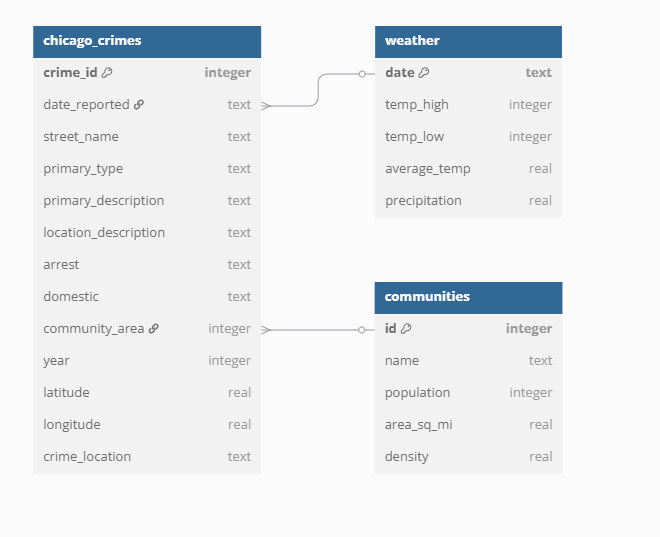

# Chicago Crimes and Weather

### This project has been inspired by [Jaime M. Shaker](https://github.com/iweld)

---

This project analyzes **crimes reported** in **Chicago**, along with **daily measured temperatures** from **2018 to 2023**.

## Data Used:
- `chicago_areas.csv`
- `chicago_temps_18-23.csv`
- `chicago_crime_2018.csv`
- `chicago_crime_2019.csv`
- `chicago_crime_2020.csv`
- `chicago_crime_2021.csv`
- `chicago_crime_2022.csv`
- `chicago_crime_2023.csv`

---

## How to Build and Import Data

To build the tables and import the CSV files into the SQLite database, use the following command:

```bash
cat schema | sqlite3 crimes.db

```
---
Once the data is imported, you can run SQL queries to analyze the data. The queries and their answers are included in queries.sql. I'm still working on some of the queries.


